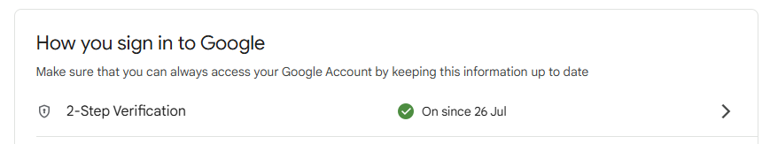
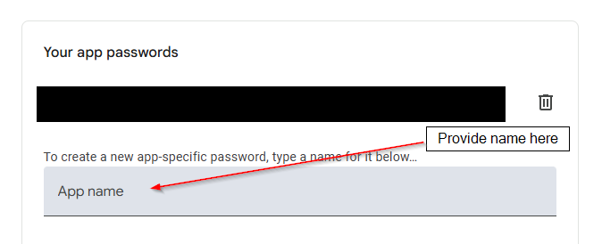
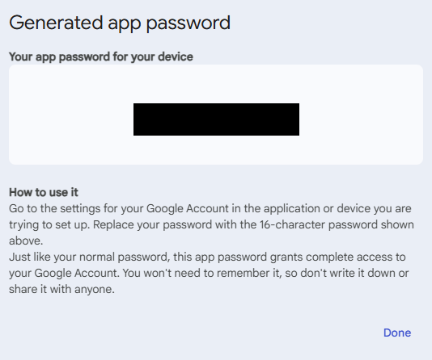

# Set up GMail Account

This brief guide explains how to set up a **GMail** account so that the application can use `EmailNotifier` to send Emails via GMail.

## Setup

- Enable 2-Step Verification (if not already):

  - Go to: https://myaccount.google.com/security
  - Hit the **Sign in** button
  - Turn on **2-Step Verification**

    

- Create an App Password:

  - Go to: https://myaccount.google.com/apppasswords
  - Provide a new **App name** (Can be any name that is meaningful to you):

    

  - Google will generate a **16-digit App Password** `EMAIL_PASSWORD` for you (like `abcd efgh ijkl mnop`). **Copy and save** this password (you won't see it again):

    

## Usage in the Application

To use GMail as a notification method, configure it in the `config.yaml` file. The `notification_type` must be set to `email`.

Example:

```yaml
NotificationConfig:
  - notification_type: email
    email_address: YOUR_EMAIL
    email_password: EMAIL_PASSWORD
    recipients: LIST_OF_RECIPIENTS_TO_SEND_NOTIFICATION
```

Replace `YOUR_EMAIL`, `EMAIL_PASSWORD`, and `LIST_OF_RECIPIENTS_TO_SEND_NOTIFICATION` with the appropriate values. `EMAIL_PASSWORD` is the one you obtained earlier.

## Simple script

Here's a basic Python script that uses `smtplib` and `email` to send an Email via GMail:

```python
import smtplib
from email.message import EmailMessage

EMAIL_ADDRESS = 'YOUR_EMAIL'
EMAIL_PASSWORD = 'EMAIL_PASSWORD'
subject = 'Test Email from Python'
recipients = 'RECIPIENTS' # Can be any Email, not only @gmail.com
message = 'This is a test email sent using Gmail and Python!'

# Create the message
msg = EmailMessage()
msg['Subject'] = subject
msg['From'] = EMAIL_ADDRESS
msg['To'] = recipients
msg.set_content(message)

# Send the email
with smtplib.SMTP_SSL("smtp.gmail.com", 465) as smtp:
    smtp.login(EMAIL_ADDRESS, EMAIL_PASSWORD)
    smtp.send_message(msg)

print("Email sent successfully!")
```
