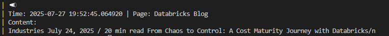
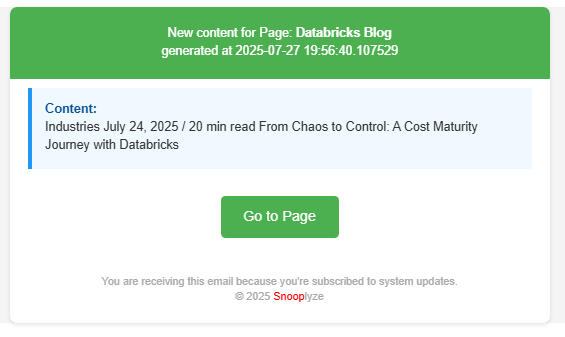
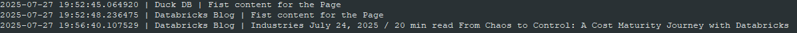
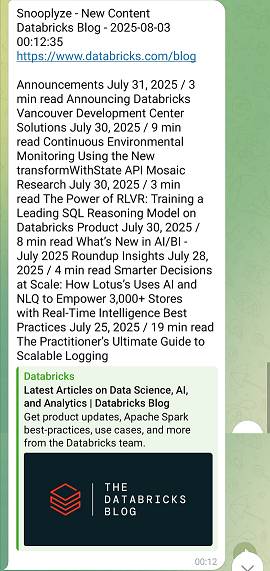
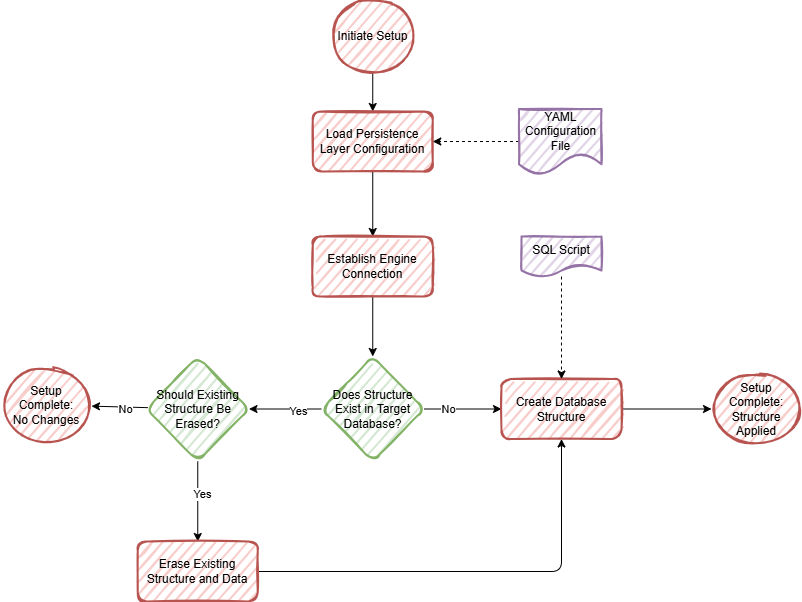
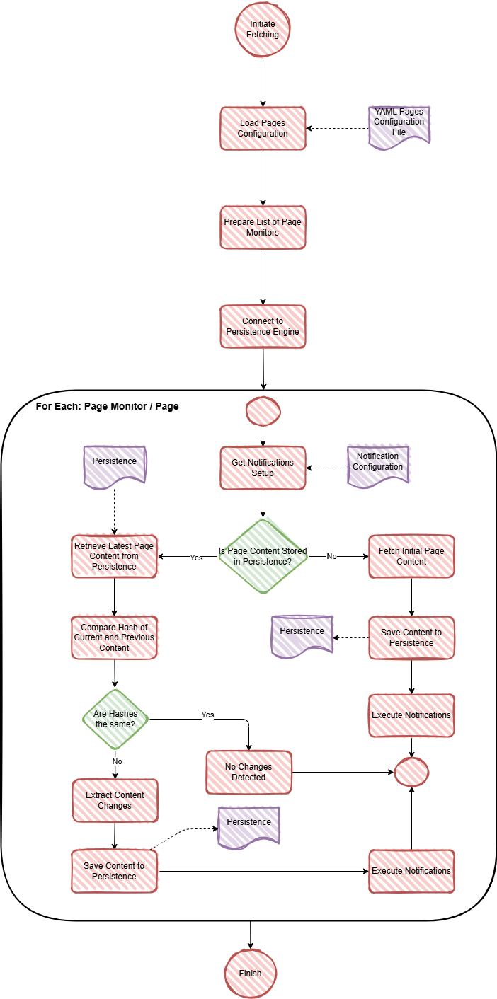

# 🧠 FeedSnooplyze - Architecture | Components | Logic

This document provides a technical deep dive into the structure, components, and logic of the **FeedSnooplyze** application. For a general overview, see [README.md](README.md).

# Basics

## Tech Stack

- ⚙️ **Backend**: Python 3.12 🐍
- 💻 **Frontend**: TBD – Not yet started. Potential options include **Streamlit**, **Reflex**, or more advanced frameworks like **React**.
- 💾 **Persistence**: Supports **SQLite**, **DuckDB**, **PostgreSQL**, and **MySQL** (with more planned).

## Folder Structure

```text
project/
├── .venv/                     # Virtual environment (ignored by Git)
├── docs/                      # Technical and user documentation
├── feedsnooplyze/             # Application source code
│   ├── configuration/         # Configuration file parsing & validation
│   ├── notifier/              # Notification systems (file, email, etc.)
│   ├── page/                  # Page-fetching and interaction logic
│   ├── parser/                # Page parsing and extraction logic
│   ├── persistence/           # Persistence Layer storage logic
│   ├── utils/                 # Utility functions and helpers
│   └── start.py               # Application main loop
├── .dockerignore              # Docker ignore rules
├── .gitignore                 # Git ignore rules
├── CHANGELOG.md               # Version history and notable changes
├── config.yaml.example        # Example config file for the application
├── Dockerfile                 # Docker setup for containerized deployment
├── README.md                  # Project overview and basic usage
├── requirements.txt           # Python dependencies
└── feedsnooplyze.yaml.example # Example config file for Pages content
```

## Modules Overview

- feedsnooplyze/configuration/ - Reads, validates, and normalizes configuration values from YAML files.
- feedsnooplyze/notifier/ - Implements notification mechanisms such as Console, Flat File, Email, etc.
- feedsnooplyze/page/ - Fetches content from web pages and extracts relevant (new) data.
- feedsnooplyze/parser/ - Parses and extracts content from pages.
- feedsnooplyze/persistence/ - Persistence engines layer for storing data.
- feedsnooplyze/utils/ - Contains reusable helper functions and classes shared across modules.

## Entry Point 🚀

The app is launched from:

```python
feedsnooplyze/start.py
```

This file loads the configuration, initializes core services, and kicks off the main runtime loop.

The app can be run:

- as a module: `python -m feedsnooplyze <your_arguments>` or
- after local installation as a Python package (`pip install -e .`): `feedsnooplyze <your_arguments>`

Definition of the project is in `pyproject.toml` file

Appropriate **arguments** must be provided during runtime (see section _Arguments_ below).

# Configuration, Packaging & Dependencies, Arguments ⚙️

## ⚙️ Configuration Files

There are 2 Configuration File types:

- **Application Configuration File**:
  - **Always** named _config.yaml_
  - Must be a valid **YAML** file
  - Defines the core configuration for the application
  - Consists of three sections:
    - General Configuration (_GeneralConfig_) - see details below
    - Persistence Configuration (_PersistenceConfig_) - see **Persistence** section.
    - Notifications Configuration (_NotificationConfig_): see **Notifications** section
- **Pages Configuration File**:
  - Can have **any** file name (provided as an argument when starting the application)
  - Must be a valid **YAML** file
  - Used to configure **Pages** and their associated **Parsers**

❗ Throughout this documentation, the terms **Application Configuration File** and **Pages Configuration File** are used consistently. Please do not confuse them.

**General Configuration**

Currently, this section contains only one parameter:

- pooling_time - When the application is run in **interactive** fetch mode, this defines the number of seconds between each loop of the main logic. The value is specified in **seconds**.

Example:

```yaml
GeneralConfig:
  pooling_time: 3600 # Run main logic every 1 hour (60 * 60 = 3600 seconds = 1 hour)
```

## Packaging & Dependencies 📦

- Python dependencies are listed in `requirements.txt`.
- The project uses a virtual environment (`.venv/`).
- A `Dockerfile` is provided for Docker-based deployment.

## Runtime Arguments

The application can run in two main **modes**:

- setup
- fetch

The mode is controlled by `-r` / `--run-mode` argument.

**Main Arguments**

Below is a list of all **command-line arguments** supported by the application:

- `-r` / `--run-mode` - Accepts one of 2 values:
  - `setup`: Initializes the **Persistence Layer** based on the _Application Configuration File_ (`config.yaml`).
  - `fetch` - Fetches content from all **Pages** defined in a _Pages Configuration File_ (see `-f` below).
- `-ft` / `fetch-type` - Used **only when** `run-mode` argument is set to `fetch`. Accepts:
  - `interactive`: Runs in an infinite loop, executing the main logic periodically (see `--pooling-time` or value from `config.yaml`).
  - `oneshot` - Runs the main logic once, then exits.
- `-p` / `pooling-time`: Optional. Used only when `--fetch-type` is set to `interactive`. Overrides the `pooling_time` value in the _Application Configuration File_. Value is in **seconds**.
- `-f` / `config-file`: Required when `--run-mode` is `fetch`. Specifies the **full path** to the _Pages Configuration File_, which defines the **Pages** and their associated **Parsers**.

# Main Components

## 📄 Page

**Pages** are responsible for configuring all the sources from which Content is retrieved and monitored for changes.

All relevant code can be found in the `feedsnooplyze/page` directory and includes:

- `page.py`: Defines ther **Page** entity, characterized by:
  - _name_
  - _url_
  - (optional) _description_
- `page_content.py`: Represents the **Content** retrieved from a given Page.
- `page_monitor.py`: Implements the **PageMonitor**, which contains the logic for:
  - Fetching Content
  - Checking whether the Content is **new** compared to previously fetched data
  - Triggering **Notifications** if changes are detected

❗ A deeper dive into this logic is provided later in the documentation.

### Setup

To add a new **Page**, the corresponding configuration must be added to the _Pages Configuration File_, including the **Parser** section.

❗ Details about parsers can be found later in the documentation.

Example setup:

```yaml
Pages: # Indicates that this is a configuration for Pages
  - name: "Duck DB" # Page name
    url: "https://duckdb.org/news/" # and it's URL
    description: "Duck DB News Page" # Optional description
    parser: # Parser section, only one parser per Page
      - type: "div_class" # type of Parser
        class_name: "newstiles" # and any additional arguments (if necessary)
  - name: "Databricks Blog" # Another Page
    url: "https://www.databricks.com/blog"
    parser:
      - type: "main_element" # Here we use another type of Parser
```

## 🧩 Parser

The **Parser** is responsible for processing extracted content to isolate the relevant parts used to detect updates.

All related code is located in the `feedsnooplyze/parser/` folder and includes:

- `base_parser.py`: Contains the `ParserBase` class, which all Parsers must inherit, and the `ParserType` enum for _Generic Parsers_.
- `custom_parsers.py`: Parsers customized for specific **Pages** (details below).
- `generic_parsers.py`: Generic Parsers not tied to any particular **Page** (details below).

### Parsing Mechanism

All parser classes, both **generic** and **custom**, must inherit from the `ParserBase` class and implement the `parse` method. This method contains the core parsing logic.

Parsing is performed using **web scraping**, specifically leveraging the **Beautiful Soup** (`bs4`) Python library.

The parsing workflow is implemented in the `feedsnooplyze/page/page_monitor.py` file.

**How it works:**

For each **Page** defined in the _Pages Configuration File_, a `PageMonitor` instance is created, associating both the page and its corresponding **Parser**. During execution, the internal `_get_content` function fetches the raw content of the web page (using the `requests` library). Then, the parser’s `parse` method processes this content, returning the parsed result according to the parser’s logic.

```python
@dataclass
class PageMonitor:
    page: Page = field(default_factory=Page)
    parser: ParserBase = field(default_factory=ParserBase)
    last_hash: Optional[str] = None
    notifiers: Optional[List[NotificationConfigBase]] = None


    def _get_content(self):

        try:

            print(f"🚀 Request to a given URL {self.page.url} has been sent")
            response = requests.get(self.page.url, timeout=60)
            response.raise_for_status()

            # Parse obtained text from the URL based on the configured Parser
            content = self.parser.parse(response.text)
```

❗ Since parsing relies on **web scraping**, it is vulnerable to changes in website layouts. If the website’s design, HTML structure, or element names change, the parsing process may break and require updates.

### Generic Parsers

Generic parsers are **not tied to any specific Page**. They implement general parsing logic such as:

- Extracting the entire document content
- Extracting content inside the `main` element
- Extracting content from a <div> with a specific `class`
- And other similar tasks

#### Configuration

**Example:**

Using a generic parser named `div_class` with a required argument `class_name` configured directly in the _Pages Configuration File_.

```yaml
Pages:
  - name: "Duck DB"
    url: "https://duckdb.org/news/"
    description: "Duck DB News Page"
    parser:
      - type: "div_class"
        class_name: "newstiles"
```

### Custom Parsers

Custom parsers are tailored to specific **Pages**. They come pre-configured and ready to use, requiring no further customization.
You only need to specify which custom parser to use for a given **Page** in the _Pages Configuration File_.

#### Configuration

**Example:**

For custom parsers, simply specify the parser name as the type — no additional arguments are needed.

```yaml
Pages:
  - name: "Duck DB"
    url: "https://duckdb.org/news/"
    description: "Duck DB News Page"
    parser:
      - type: "duckdb_blog"
```

#### Extensibility of Custom Parsers

The goal is to **provide as many custom parsers as possible** so users can easily reuse them when configuring the _Pages Configuration File_ — without needing to write parsing logic themselves.

Currently, all custom parsers are implemented as Python classes. To add a new custom parser, a new class must be written. While this works, it’s not ideal for extensibility.

**Future goal**: Enable configuring custom parsers externally (e.g., via YAML or another config file) so new parsers can be added without modifying the codebase.

## 💾 Persistence

The **Persistence Layer** is responsible for storing all the **Pages** Content and **Notifications** produced by the application.

**Adding a New Persistence Engine**

All related code is located in the `feedsnooplyze/persistence/` folder.

To add a new Persistence Engine, two steps must be done:

1. A new class that inherits from **PersistenceEngine** class must be created and these below methods must be implemented:

- create_structure: used in **setup** mode, creates a structure for a given Persistence Engine.
- connect: connects to a Persistence Engine and returns a connection handler.
- add_content: adds new information about Page's Content.
- is_content_available: checks if a given Page's Content is already available in the Persistence Storage.
- get_latest_by_name: get latest Page's Content for a given Page name as a parameter

2. New type must be added to **PersistenceEngineType** Enum in **PersistenceEngine** class

To add a new persistence engine, follow these steps:

1. **Create a new class** that inherits from the `PersistenceEngine` base class and implement the following methods:

- `create_structure`: Used in **setup** mode to create the necessary structure for the persistence engine.
- `connect`: Connects to the persistence engine and returns a connection handler.
- `add_content`: Adds new information about a page’s content.
- `is_content_available`: Checks if a given page’s content already exists in the persistence storage.
- `get_latest_by_name`: Retrieves the latest content for a given page name.

2. **Add the new type** to the `PersistenceEngineType` enum in the PersistenceEngine class.

Example:

1.

```python
class YourNewPersistenceEngine(PersistenceEngine):

    def __init__(self, argument: str):
    self.argument = file_path

    # All abstract methods from PersistenceEngine class must be implemented
```

2.

```python
class PersistenceEngineType(str, Enum):
    # other Enums that are here ...
    # ...
    # ...
    YOURNEWPERSISTENCEENGINENAME = "YOURNEWPERSISTENCEENGINENAME"
```

To enable the Persistence Layer, the appropriate configuration for the persistence engine must be set up in the _Application Configuration File_. Below is an explanation of how each currently implemented persistence engine works and how to configure them.

### DuckDB Persistence Engine

**Setup**

This persistence engine requires **one argument**:

- `db_file_path`: Full path to the DuckDB database file.

Example configuration:

```yaml
PersistenceConfig:
  persistence: duckdb
  db_file_path: full_file_path_to_your_duckdb_file (ex. c:\myengine.duckdb)
```

### 🐬 MySQL Persistence Engine

**Setup**

❗ Before using this engine, a database named `database` must be created manually on the MySQL server.

This persistence engine requires **five arguments**:

- `host`: Hostname or IP address of the MySQL server
- `port`: Port number (typically 3306)
- `user`: Username with access to the database
- `password`: Password for the above user
- `database`: Name of the target database

Example configuration:

```yaml
PersistenceConfig:
  persistence: mysql
  host: mysql_host
  port: port_of_mysql
  user: user_name
  password: password_of_the_above
  database: db_name
```

### 🐘 PostgreSQL Persistence Engine

**Setup**

❗ Before using this engine, a database named `database` must be created manually on the PostgreSQL server.

This persistence engine requires **one argument**:

- `connection_string`: Full connection string to the PostgreSQL database.

Example configuration:

```yaml
PersistenceConfig:
  persistence: postgresql
  connection_string: "dbname=your_db_name user=user_name password=password_for_user host=name_or_ip_address_of_postgresql_engine port=port_of_postgresql_engine"
```

### 🗃️ SQLite Persistence Engine

**Setup**

This persistence engine requires **one argument**:

- `db_file_path`: Full path to the SQLite database file.

Example configuration:

```yaml
PersistenceConfig:
  persistence: sqlite
  db_file_path: full_file_path_to_your_sqlite_file (ex. c:\myengine.sqlite)
```

## 🔔 Notifications

**Notifications** are used to inform users when content changes are detected on **Pages** they are monitoring.

All related code is located in the `feedsnooplyze/notifier/` folder.

**Adding a New Notifier**

To implement a new **Notifier**, follow these steps:

1. **Create a new class** that inherits from the `Notifier` base class, and implement the `notify` method.
2. **Add a new type** to the `NotifierType` enum in the `Notifier` class.

Example:

1.

```python
class YourNewNotifier(Notifier):

    def __init__(self, argument: str):
    self.argument = file_path

    def notify(self, message): # This method must be implemented
        # Here your code with the notifier logic
```

2.

```python
class NotifierType(str, Enum):
    # other Enums that are here ...
    # ...
    # ...
    YOURNEWNOTIFIER = "YOURNEWNOTIFIER"

```

To enable **Notifiers**, the appropriate configuration must be defined in the _Application Configuration File_. Below is an overview of all currently implemented notifiers, including how they work and how to configure them.

### Console Notifier

#### Setup

This notifier requires no arguments.

Example configuration:

```yaml
NotificationConfig:
  - notification_type: console
```

#### Output

When enabled, this notifier sends notifications directly to the console output:



### Email Notifier

#### Setup

⚠️ Currently, only **Gmail** accounts are supported. A more generic email support is under development.

⚠️ In order to setup **Gmail** account and obtain a 16-digit code user for authentication, please read [GMail Setup Instruction](gmail-setup.md).

This notifier requires **three arguments**:

- `email_address`: Gmail address from which the email will be sent.
- `email_password`: App-specific password for the Gmail account (a _16-character code_).
- `recipients`: List of email addresses to receive the notifications.

Example configuration:

```yaml
NotificationConfig:
  - notification_type: email
    email_address: GMail Email address of the sender (ex. John.Doe@gmail.com)
    email_password: 16-letter GMail App code (ex. erthbjirtyewnolz)
    recipients: list of recipients to whom notification will be sent (ex. [albert.einstein@outlook.com, max.planck@gmail.com])
```

#### Output

When enabled, this notifier sends a Notification Email to a given Recipients:



### Flat File Notifier

#### Setup

This notifier requires one argument:

- `file_path`: Full path to the file where notifications will be written.

Example configuration:

```yaml
NotificationConfig:
- notification_type: flatfile
    file_path: full_path_to_nofitication_file (ex. C:\notifications.txt)
```

#### Output

When enabled, this notifier appends notifications to the file specified by the `file_path` argument.

Each entry in the file follows this structure:

`Date and Time of Entry | Page Name | New Content that has been detected`

Extract from the File (example):



### Telegram Notifier

#### Setup

⚠️ In order to setup **Telegram Bot** account and obtain all the necessary configuration for authentication and sending messages,
please read [Telegram Bot Setup Instruction](telegram-setup.md).

This notifier requires **two arguments**:

- `token`: Token of your created **Telegram Bot**
- `chat_id`: Id of your **Chat** with your created **Telegram Bot**

Example configuration:

```yaml
NotificationConfig:
  - notification_type: telegram
    token: Token of your created Telegram Bot
    chat_id: id of your Chat with your created Bot
```

#### Output

Once enabled, this notifier sends a Telegram message to the **Telegram Bot** specified during setup:



# Main modes and their logic

As mentioned earlier, the application runs in two main **modes**:

- `setup`
- `fetch`

Below is a detailed explanation of what happens in each mode:

## Setup mode

When the application runs in `setup` mode, it configures the **Persistence Layer** according to the _Application Configuration File’s_ (_PersistenceConfig_ section).

The logic flow is as follows:



Explanation of Key Steps:

- `Establish Engine Connection`: Connects to the specified **Persistence Engine** using the details from the _Application Configuration File_ and returns a connection handler.
- `Create Database Structure`: Runs the `structure.sql` script located in the `persistence\<Persistence_Engine>\scripts\` directory to set up the required database schema.

**Note:** Some persistence engine folders include a `docker-compose.yml` file that can be used to quickly launch a local instance of the engine.

## Fetch mode

When the application runs in `fetch` mode, it executes the main logic of the application.

The flow is illustrated below:



Explanation of Key Steps:

- `Prepare List of Page Monitors`: Creates a **PageMonitor** (including the associated **Parser** configuration) for each **Page**.
- `Main Loop`: Iterates over each **PageMonitor** to perform the fetch cycle.
- `Get Notifications Setup`: Attaches configured **Notification** mechanisms to each **PageMonitor**.
- `Check if Page Content Exists`: Verifies if content for the given **Page** is already stored in persistence.
- `Compare Content Hashes`: Computes `SHA-256` hashes of the current content (fetched during runtime) and the latest saved content, then compares them to detect any changes.
- `Extract Content Changes`: Uses the `ContentComparer` class (in `utils/content_comparer.py`) to isolate the new or changed content.
- `Execute Notifications`: Triggers all configured notifications for the detected changes.

# 📌 Future Improvements

All planned future improvements are detailed in the [README.md](README.md) file.
