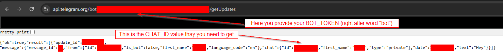

# Set up Telegram Bot

This brief guide explains how to set up a **Telegram Bot** account so that the application can use `TelegramNotifier` to send messages via the bot.

## Setup

- Create a Telegram Bot
  - Open Telegram and search for **BotFather**.
  - Start a chat with BotFather and send `/newbot`.
  - Follow the instructions to set the bot name and username.
  - After completion, BotFather will give you a `BOT_TOKEN` - it looks like `123456789:ABCdefGhIjKlMnOpQRsTUVwxyZ`.
- Get your Chat ID

  You’ll need the `CHAT_ID` to send messages. If you want to message yourself:

  - Start a chat with _your newly created bot_ by searching it in Telegram and pressing **Start**.
  - Send any message to the bot (e.g. _"Hi"_) **Note:** The next step won’t work unless the bot has received at least one message.
  - Open the following URL in your browser, replacing `BOT_TOKEN` with the token you received:

    ```bash
    https://api.telegram.org/botBOT_TOKEN/getUpdates
    ```

  - In the JSON response, look for a field like:

    ```json
    "chat": { "id": 123456789, ... }
    ```

    The `id` value is your `CHAT_ID`.

    Example:

    

## Usage in the Application

To use Telegram as a notification method, configure it in the `config.yaml` file. The `notification_type` must be set to `telegram`.

Example:

```yaml
NotificationConfig:
  - notification_type: telegram
    token: BOT_TOKEN
    chat_id: CHAT_ID
```

Replace `BOT_TOKEN` and `CHAT_ID` with the values you obtained earlier.

## Simple script

Here's a basic Python script that uses `requests` to send a message via your Telegram bot:

```python
import requests

BOT_TOKEN = 'YOUR_BOT_TOKEN'
CHAT_ID = 'YOUR_CHAT_ID'
telegram_message = 'Hello from Python!'

url = f"https://api.telegram.org/bot{BOT_TOKEN}/sendMessage"

payload = {
    'chat_id': CHAT_ID,
    'text': telegram_message
}

response = requests.post(url, data=payload)

print(response.json())
```

Make sure to replace `'YOUR_BOT_TOKEN'` and `'YOUR_CHAT_ID'` with your actual values.
